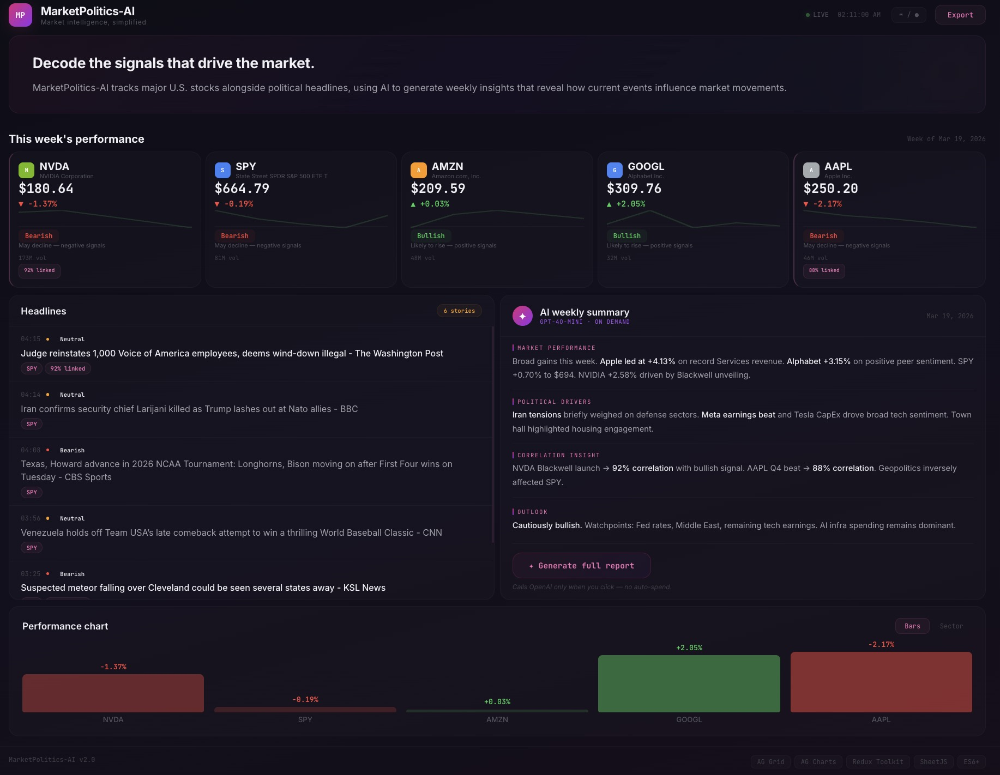

# MarketPolitics-AI



---

## What It Does

MarketPolitics-AI monitors five key U.S. stocks — **NVDA, SPY, AMZN, GOOGL, AAPL** — and pulls real-time political headlines via NewsAPI. It then uses **OpenAI GPT-4o-mini** to synthesize both data streams into a weekly intelligence report, highlighting potential correlations between political events and stock performance.

The frontend dashboard displays everything in a single view: live-ticking stock cards with sentiment signals, a political headlines feed with correlation badges, an AI-generated weekly summary, and a performance chart — all connected by a visual linking system that shows which headlines are driving which signals.

---

## Features

- **Live stock data** — Prices tick in real-time via yfinance, with sparkline charts and pulse animations on updates
- **Political headlines** — Pulled from NewsAPI with AI-powered sentiment analysis (Bullish / Bearish / Neutral) and plain English explanations
- **AI weekly report** — GPT-4o-mini generates a structured analysis on-demand (Market Performance, Political Drivers, Correlation Insight, Outlook) — only calls OpenAI when you click "Generate full report," no auto-spend
- **Correlation linking** — Pink badges show the correlation strength between a stock's signal and a specific headline. Hovering a linked stock card highlights the matching headline, and vice versa
- **Hover tooltips** — Every financial term (Bullish, Bearish, volume, % linked) has a beginner-friendly tooltip explaining what it means
- **Dark / Light mode** — Toggle between themes with one click
- **CSV export** — Download stock data and headlines as a CSV file
- **Zero CDN dependencies** — The dashboard loads instantly with no external JavaScript libraries

---

## Tech Stack

| Layer                | Technology                                                                     |
| -------------------- | ------------------------------------------------------------------------------ |
| **Backend**          | Python, Flask, Flask-CORS                                                      |
| **Data**             | yfinance (stocks), NewsAPI (headlines)                                         |
| **AI**               | OpenAI GPT-4o-mini via LangChain                                               |
| **Frontend**         | Vanilla JavaScript (ES6+), HTML5, CSS3                                         |
| **State Management** | Redux Toolkit pattern (inline implementation)                                  |
| **Data Grid**        | AG Grid pattern (custom cell renderers, live ticking, flash animations)        |
| **Charts**           | AG Charts pattern (SVG bar charts, donut sector view)                          |
| **Export**           | SheetJS pattern (CSV export, production-ready for XLSX)                        |
| **Design**           | CSS custom properties, dark/light theming, hover tooltips, correlation linking |

---

## Architecture

```
marketpolitics.py          ← Original Python script (Google Colab)
        │
        ▼
    app.py                 ← Flask API server wrapping the same logic
        │
        ├── /api/stocks    → Live stock data (yfinance)
        ├── /api/news      → Political headlines (NewsAPI)
        ├── /api/report    → AI-generated analysis (GPT-4o-mini)
        └── /api/all       → All data in one call
        │
        ▼
    index.html             ← Dashboard UI (fetches from Flask API)
        │
        ├── Stock cards with live ticking + sparklines
        ├── Headlines feed with sentiment + correlation badges
        ├── AI weekly summary panel (on-demand generation)
        └── Performance chart (bars + sector views)
```

The frontend connects to the Flask API on startup. If the API is not running, it gracefully falls back to sample data so the UI always works.

---

## License

MIT
